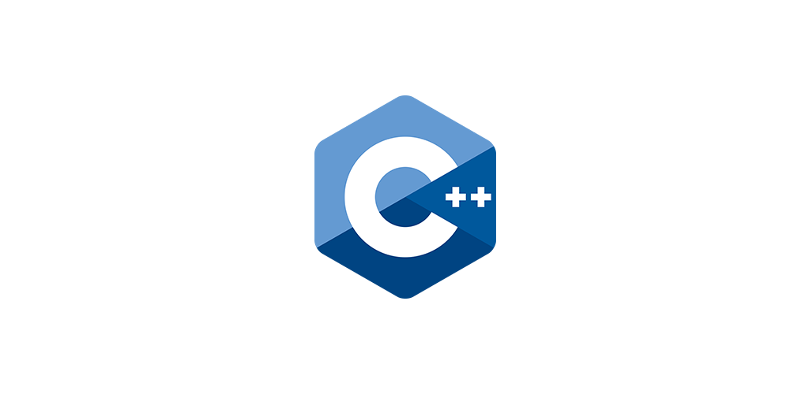

# C/Cpp Compiler on Android - CPP N-IDE
## C/C++ compiler for Android device using GCC compiler

This project is developed to help the community to learn C or C++ on the go.

You can use this app to code and compile C/C++ project without Internet.

## Android install
- For arm devices: download ``app-arch_armeabi_v7a-release.apk`` in release
- For x86 devices: download ``app-arch_x86-release.apk`` in release

## Features

- C compiler
- C++ compiler
- Terminal emulator
- Diagnostic utility: auto jump to error position
- Compiler output
- Syntax highlighting
- C/C++ examples from https://www.programiz.com/cpp-programming/examples
- File manager
- Multi Tab: you can open different files in different tabs to manage editing multiple files simultaneously with ease.
- Easy toolbar: you can quickly create a new file, open, save, save as, undo/redo, insert some commonly used symbols, go back to last edit location, etc.
- List of recently opened files
- Regular search, replace or replace all
- Change the typeface and font size
- Show line numbers
- Show whitespace characters (tabs, line breaks)
- Regular search, replace or replace all
- "Word wrap" switch
- Lock the screen orientation in auto, horizontal or vertical
- Remember the last opened file
- Hide the soft keyboard, long press the edit area can be turn on
- Convert selected text to uppercase or lowercase by long pressing the "edit area"
- Automatic indentation
- Keep the screen awaken
- Dark/Light Themes

## TODO
- Code completion
- Real-time diagnostics (warnings, errors) and suggestion to fix it
- Static code analysis
- Code indention

## Pull request always welcomed.

## License
GNU GPL V3.0

    Copyright (C) 2018 Tran Le Duy	

    This program is free software: you can redistribute it and/or modify
    it under the terms of the GNU General Public License as published by
    the Free Software Foundation, either version 3 of the License, or
    (at your option) any later version.

    This program is distributed in the hope that it will be useful,
    but WITHOUT ANY WARRANTY; without even the implied warranty of
    MERCHANTABILITY or FITNESS FOR A PARTICULAR PURPOSE.  See the
    GNU General Public License for more details.

    You should have received a copy of the GNU General Public License
    along with this program.  If not, see <http://www.gnu.org/licenses/>.
